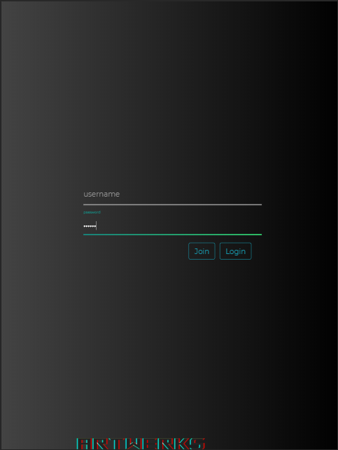
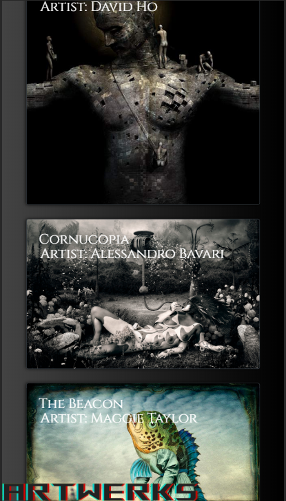

# Artwerks
Social media platform for artists, from novice to professional, to showcase and share their works.

## Screen Grab 

## Built With

* [React](https://reactjs.org)
* [HTML](https://developer.mozilla.org/en-US/docs/Web/HTML)
* [CSS](https://developer.mozilla.org/en-US/docs/Web/CSS)
* [SASS](https://sass-lang.com)
* [Bootstrap](https://getbootstrap.com)
* [JavaScript](https://javascript.com)
* [nodejs](https://nodejs.com)

## Deployed Link

* [Github Repository Page](https://github.com/rev1311/arterwks)
* [React App Page](https://rev1311.github.io/artwerks)

## Authors

* **Michael Partin** 

- [Link to Portfolio Site](https://rev1311.github.io/react-portfolio/)
- [Link to Github](https://github.com/rev1311)
- [Link to LinkedIn](https://linkedin.com/in/michael-partin)

See also the list of [contributors](https://github.com/your/project/contributors) who participated in this project. HINT: Just me.

